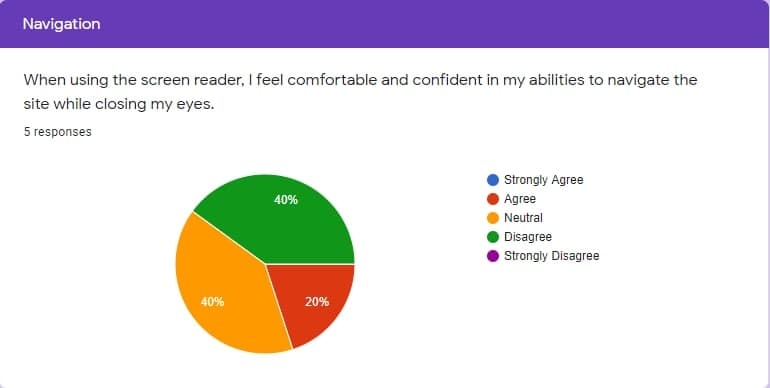
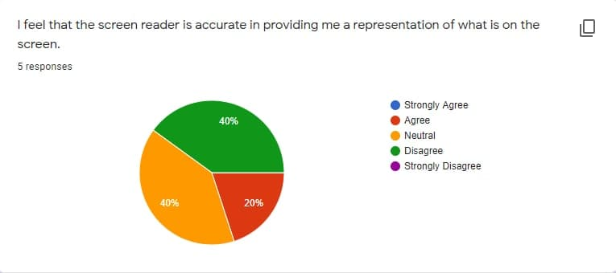
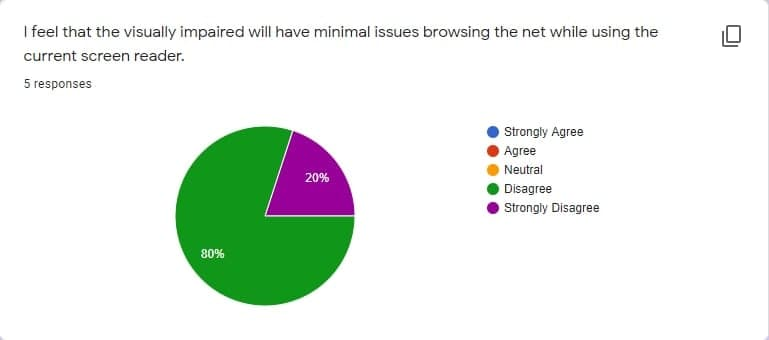
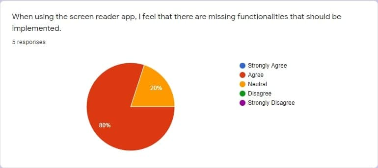

# **Orbital 2021**

## Team buttersmarsh (Gemini)

# **Orbital 2021**

## Team buttersmarsh (Gemini)

* [**Orbital 2021**](#orbital-2021)
    * [Team buttersmarsh (Gemini)](#team-buttersmarsh-gemini)
        * [1. Project Problem](#1-project-problem)
        * [2. Solution](#2-solution)
        * [3. User Stories](#3-user-stories)
        * [4. Features](#4-features)
        * [5. Development Plan ](#5-development-plan-)
        * [6. Link to Guides](#6-link-to-guides)

### 1. Project Problem

The current existing voiceover/ text-to-speech apps for the visually impaired are not streamlined. Often, times, they read out [irrelevant html tags](https://www.bbc.com/news/world-us-canada-49694453), and may offer [no flexibility in terms of browsing](https://qz.com/1407450/theres-already-a-blueprint-for-a-more-accessible-internet/). Furthermore, current screen readers do not offer additional functionality in terms of [ad management](https://qz.com/1800064/for-blind-facebook-users-ads-havent-been-labeled-as-ads/).

### 2. Solution

As such, our team aims to make a chrome web extension with additional features for the visually impaired, providing a more streamlined experience for users. The extension will inject itself and work on activation when viewing a webpage. It avoids reading irrelevant html tags and categorize them accordingly for easier navigation.

The unique feature of our app would be ad detection. Users are provided the ability to mark ads to prevent them from popping up again, and add them to a list.

The ultimate aim is to make the internet a more inclusive and accessible environment for all.

### 3. User Stories

Our team has conducted an initial survey to find out the current situation with the screen reader apps. 

The initial survey was done on Google Forms and can be found [here](https://forms.gle/WyxcTo7292mQR5iu7).

For our survey, we made 5 users download the current available screen reader on the Chrome store. From our testing, this was found to be one of the best screen readers out of many available for use. We then asked our users several questions, with the results shown below.

As such, after rounding up our survey results, we believe that this is indeed an issue that is in need of alleviation, and our group will try to implement the features that have been suggested to us as stated above. More information about the different features can be read under Section 6.

*NOTE: While the survey may still be open, it is only open for reference and future responses will not be reflected into our documentation.* 

### 4. Features

- Easy to use and change settings
- Interface for both visually impaired and sighted users to navigate
- Out of the box
- Lightweight and will not hinder with other background processes
- Ability to skip ads and provide a cache system to keep track of blacklisted ads
- Able to fast forward or go back on the go to skip unnecessary text blocks

### 5. Development Plan 

**<u>Milestone 1 (Ideation): *31st May*</u>**

 - Learn more about the different APIs used
 - Learn more about web browser programming
 - Preliminary research on Machine Learning Tools
 - Gathering feedback on current implementations

**<u>Milestone 2 (Prototype): *28th June*</u>**

 - Able to filter out nested tags
 - Application is ready for production but still at the alpha stage
 - Base settings are configured
 - Experiment with users to gain feedback

**<u>Milestone 3 (Extension): *26th July*</u>**

 - Clean up existing features
 - Make code more streamlined
 - Package for production

### 6. Link to Guides

- [User Guide](https://github.com/RyanCheungJF/Synch/blob/main/docs/UserGuide.md)
- [Developer Guide](https://github.com/RyanCheungJF/Synch/blob/main/docs/DeveloperGuide.md)
- Learning Outcomes (To be done by Milestone 3.)

### 1. Project Problem

The current existing voiceover/ text-to-speech apps for the visually impaired are not streamlined. Often, times, they read out [irrelevant html tags](https://www.bbc.com/news/world-us-canada-49694453), and may offer [no flexibility in terms of browsing](https://qz.com/1407450/theres-already-a-blueprint-for-a-more-accessible-internet/). Furthermore, current screen readers do not offer additional functionality in terms of [ad management](https://qz.com/1800064/for-blind-facebook-users-ads-havent-been-labeled-as-ads/).

### 2. Solution

As such, our team aims to make a chrome web extension with additional features for the visually impaired, providing a more streamlined experience for users. The extension will inject itself and work on activation when viewing a webpage. It avoids reading irrelevant html tags and categorize them accordingly for easier navigation.

The unique feature of our app would be ad detection. Users are provided the ability to mark ads to prevent them from popping up again, and add them to a list.

The ultimate aim is to make the internet a more inclusive and accessible environment for all.

### 3. User Stories

Our team has conducted an initial survey to find out the current situation with the screen reader apps. 

The initial survey was done on Google Forms and can be found [here](https://forms.gle/WyxcTo7292mQR5iu7).

For our survey, we made 5 users download the current available screen reader on the Chrome store. From our testing, this was found to be one of the best screen readers out of many available for use. We then asked our users several questions, with the results shown below.

As such, after rounding up our survey results, we believe that this is indeed an issue that is in need of alleviation, and our group will try to implement the features that have been suggested to us as stated above. More information about the different features can be read under Section 6.

*NOTE: While the survey may still be open, it is only open for reference and future responses will not be reflected into our documentation.* 

### 4. Features

- Easy to use and change settings
- Interface for both visually impaired and sighted users to navigate
- Out of the box
- Lightweight and will not hinder with other background processes
- Ability to skip ads and provide a cache system to keep track of blacklisted ads
- Able to fast forward or go back on the go to skip unnecessary text blocks

### 5. Development Plan 

**<u>Milestone 1 (Ideation): *31st May*</u>**

 - Learn more about the different APIs used
 - Learn more about web browser programming
 - Preliminary research on Machine Learning Tools
 - Gathering feedback on current implementations

**<u>Milestone 2 (Prototype): *28th June*</u>**

 - Able to filter out nested tags
 - Application is ready for production but still at the alpha stage
 - Base settings are configured
 - Experiment with users to gain feedback

**<u>Milestone 3 (Extension): *26th July*</u>**

 - Clean up existing features
 - Make code more streamlined
 - Package for production

### 6. Link to Guides

- [User Guide](https://github.com/RyanCheungJF/Synch/blob/main/docs/UserGuide.md)
- [Developer Guide](https://github.com/RyanCheungJF/Synch/blob/main/docs/DeveloperGuide.md)
- Learning Outcomes (To be done by Milestone 3.)

### 7. Credits

Credit due for [Markdown Table of Contents Generator](https://github.com/Relex12/Markdown-Table-of-Contents) to Adrian Bonnet.
